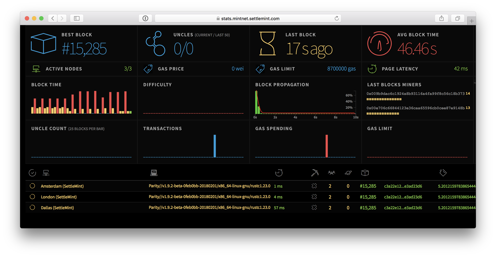
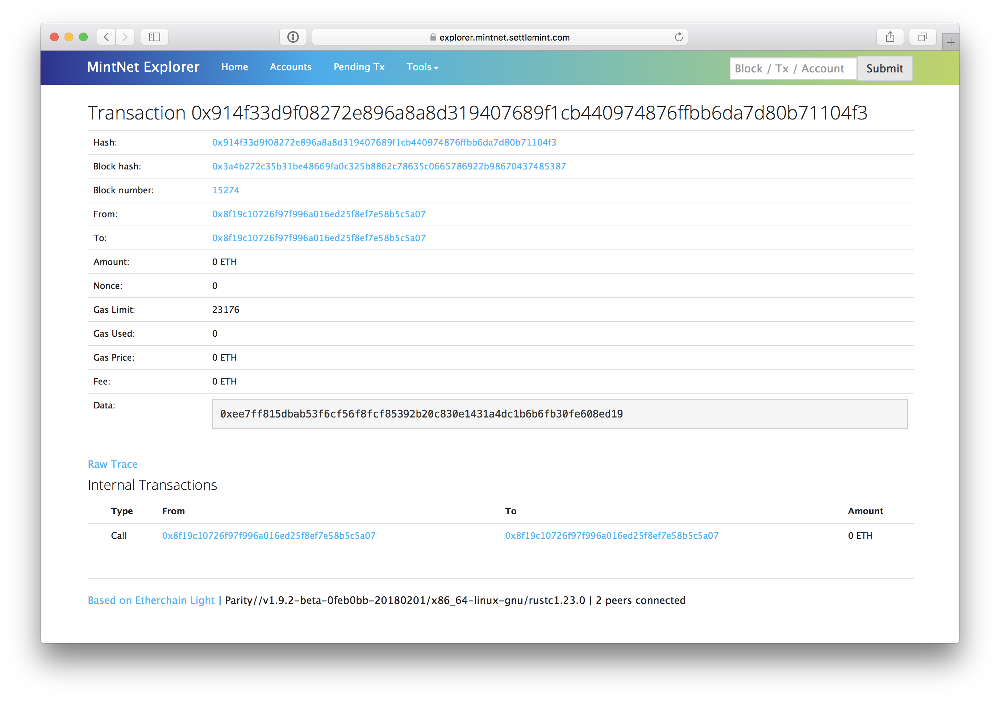

# MintNet

MintNet is an open, Proof-of-Authority, Ethereum network with 5 second block times and no gas costs. It is free to use, open to join, now go out andd BUIDL!

## About

The blockchain network underlying this system is [Ethereum](https://www.ethereum.org/), using a [Proof-of-Authority consensus engine](https://en.wikipedia.org/wiki/Proof-of-authority). Proof-of-Authority is a replacement for Proof-of-Work and is well suited for consortium and semi-public chain setups as it does not depend on nodes solving arbitrarily complex mathematical problems, but instead uses a set of "authorities" - nodes that are explicitly allowed to create new blocks and secure the blockchain. A Poof-of-Authority chain has to be signed off by the majority of authorities and when this is done, the record is permanently committed and recorded.

In a consortium setting, there are only advantages to using a Proof-of-Authority network. It is more secure than a small Proof-of-Work network since an attacker who gains unwanted connection or who has hacked an authority cannot overwhelm the network to modify or revert transaction. It is less computationally intensive, more performant and more predictable. Teh tradeoff is that there is a level of trust for the nodes that have been assigned the mining authority.

MintNet is such a semi-public network. It has been configured in such a way that transaction costs (gas) that are associated with Ethereum transactions are removed and blocks are created in 5 second intervals. This eliminates the need for complex steps to fund wallets prior to executing a transaction on the network and it prevents having to deal with the unstable cryptocurrency exchange rates. More statistics on [https://stats.mintnet.settlemint.com](https://stats.mintnet.settlemint.com)

On top of this network, a publicly available blockchain explorer is available at [https://explorer.mintnet.settlemint.com](https://explorer.mintnet.settlemint.com). Using this explorer, anyone can independently validate the content of the transactions.

# Running a node
