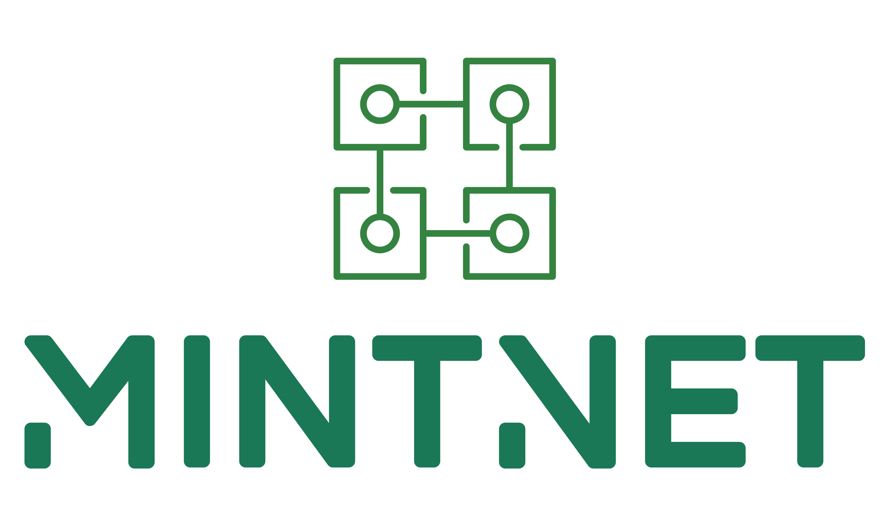

Repository for the client to join the [**MintNet**](https://stats.mintnet.settlemint.com/) Ethereum network.

[](https://hub.docker.com/r/settlemint/mintnet/)
[](https://hub.docker.com/r/settlemint/mintnet/)
[](https://hub.docker.com/r/settlemint/mintnet/)

MintNet is an open, Proof-of-Authority, Ethereum network with 5 second block times and no gas costs. It is free to use, open to join, now go out and BUIDL!

## About

The blockchain network underlying this system is [Ethereum](https://www.ethereum.org/), using a [Proof-of-Authority consensus engine](https://en.wikipedia.org/wiki/Proof-of-authority). Proof-of-Authority is a replacement for Proof-of-Work and is well suited for consortium and semi-public chain setups as it does not depend on nodes solving arbitrarily complex mathematical problems, but instead uses a set of "authorities" - nodes that are explicitly allowed to create new blocks and secure the blockchain. A Poof-of-Authority chain has to be signed off by the majority of authorities and when this is done, the record is permanently committed and recorded.

In a consortium setting, there are only advantages to using a Proof-of-Authority network. It is more secure than a small Proof-of-Work network since an attacker who gains unwanted connection or who has hacked an authority cannot overwhelm the network to modify or revert transaction. It is less computationally intensive, more performant and more predictable. Teh tradeoff is that there is a level of trust for the nodes that have been assigned the mining authority.


MintNet is such a semi-public network. It has been configured in such a way that transaction costs (gas) that are associated with Ethereum transactions are removed and blocks are created in 5 second intervals. This eliminates the need for complex steps to fund wallets prior to executing a transaction on the network and it prevents having to deal with the unstable cryptocurrency exchange rates. More statistics on [https://stats.mintnet.settlemint.com](https://stats.mintnet.settlemint.com)


On top of this network, a publicly available blockchain explorer is available at [https://explorer.mintnet.settlemint.com](https://explorer.mintnet.settlemint.com). Using this explorer, anyone can independently validate the content of the transactions.

# Running a node

To run a node on the network, you should use the provided Docker container.

Docker is easy to install following the instructions for [Ubuntu](https://docs.docker.com/install/linux/docker-ce/ubuntu/), [MacOS](https://docs.docker.com/docker-for-mac/install/), and [Windows](https://docs.docker.com/docker-for-windows/install/).

To run the node, start the [MintNet Docker container](https://hub.docker.com/r/settlemint/mintnet/) like so:

```sh
$ docker run -d settlemint/mintnet:latest

Unable to find image 'settlemint/mintnet:latest' locally
latest: Pulling from settlemint/mintnet
324d088ce065: Already exists
2ab951b6c615: Already exists
9b01635313e2: Already exists
04510b914a6c: Already exists
83ab617df7b4: Already exists
73f8b768aee9: Already exists
de89923f1a8f: Already exists
be8fe5a8caf6: Already exists
785ce520ed7b: Pull complete
352b1fd2dc4f: Pull complete
202a2084ee80: Pull complete
5cc3ad2e6bd1: Pull complete
5c121415833e: Pull complete
60e135e85cd1: Pull complete
Digest: sha256:4fc56ab481fb81726945fc82e763e26da0e72f335fc649349080a77dce5d19b4
Status: Downloaded newer image for settlemint/mintnet:latest
40fd5d1f40608a020394d4233f5d2eb5b5d167076ba72eb37a9d01bcdff24d92
```

Check if the node is running:

```sh
$ docker ps
CONTAINER ID        IMAGE                            COMMAND                  CREATED             STATUS              PORTS                                                                                                                    NAMES
40fd5d1f4060        settlemint/mintnet:latest        "/entrypoint.sh"         18 seconds ago      Up 21 seconds       8080/tcp, 8180/tcp, 8545/tcp                                                                                             zen_chandrasekhar
```

And follow the progress and action of the node by tailing the logs.

```sh
$ docker logs -f 40fd5d1f4060
Loading config file from /etc/mintnet/mintnet.toml
2018-06-12 16:44:59 UTC Starting Parity/v1.11.3-beta-a66e36b-20180605/x86_64-linux-gnu/rustc1.26.2
2018-06-12 16:44:59 UTC Keys path /mnt/io.parity.ethereum/keys/MintNet
2018-06-12 16:44:59 UTC DB path /mnt/io.parity.ethereum/chains/MintNet/db/b0db79331389383f
2018-06-12 16:44:59 UTC Path to dapps /mnt/io.parity.ethereum/dapps
2018-06-12 16:44:59 UTC State DB configuration: fast +Trace
2018-06-12 16:44:59 UTC Operating mode: active
2018-06-12 16:44:59 UTC Warning: Warp Sync is disabled because tracing is turned on.
2018-06-12 16:44:59 UTC Configured for MintNet using AuthorityRound engine
2018-06-12 16:45:04 UTC Public node URL: enode://d2196f1612f83430e97f6194f24817cba2af3a99e8cbe47cc9f234d6d0736e462831e010248acd38971f7eeb6bf8c75f6e50a07d7b1e11eefd31ddf4d94ffec7@172.17.0.3:30303
2018-06-12 16:45:09 UTC Syncing   #18605 0xfadd…39b4  1865 blk/s   43 tx/s  16 Mgas/s      0+25081 Qed    #43688    3/25 peers      6 MiB chain   52 MiB db   38 MiB queue    4 MiB sync  RPC:  0 conn,  0 req/s,   0 µs
2018-06-12 16:45:19 UTC Syncing   #39966 0xf09d…e364  2137 blk/s   26 tx/s   8 Mgas/s      0+24549 Qed    #64516    3/25 peers      3 MiB chain   81 MiB db   38 MiB queue    5 MiB sync  RPC:  0 conn,  0 req/s,   0 µs
2018-06-12 16:45:29 UTC Syncing   #60844 0x0e5a…81f9  2090 blk/s   31 tx/s  22 Mgas/s      0+24497 Qed    #85344    3/25 peers      3 MiB chain   78 MiB db   38 MiB queue    5 MiB sync  RPC:  0 conn,  0 req/s,   0 µs
2018-06-12 16:45:39 UTC Syncing   #78310 0xa8f9…c319  1750 blk/s   26 tx/s  11 Mgas/s      0+21155 Qed    #99466    3/25 peers      3 MiB chain   75 MiB db   38 MiB queue    4 MiB sync  RPC:  0 conn,  0 req/s,   0 µs
2018-06-12 16:45:49 UTC Syncing   #95409 0x5ccd…ee4f  1713 blk/s   49 tx/s  22 Mgas/s      0+11905 Qed   #107316    3/25 peers      3 MiB chain   74 MiB db   36 MiB queue    7 MiB sync  RPC:  0 conn,  0 req/s,   0 µs
2018-06-12 16:45:59 UTC Syncing  #102960 0xbe74…260f   757 blk/s  673 tx/s 322 Mgas/s      0+20994 Qed   #123953    3/25 peers      3 MiB chain   90 MiB db   40 MiB queue    8 MiB sync  RPC:  0 conn,  0 req/s,   0 µs
2018-06-12 16:46:09 UTC Syncing  #109979 0x9cf0…c183   704 blk/s  506 tx/s 242 Mgas/s      0+26670 Qed   #136653    3/25 peers      5 MiB chain   91 MiB db   39 MiB queue    8 MiB sync  RPC:  0 conn,  0 req/s,   0 µs
2018-06-12 16:46:19 UTC Syncing  #129293 0xc282…22a8  1935 blk/s    0 tx/s   0 Mgas/s      0+26027 Qed   #155322    3/25 peers      6 MiB chain   98 MiB db   38 MiB queue    8 MiB sync  RPC:  0 conn,  0 req/s,   0 µs
```

## Adding your node to the statistics interface

The statistics interface is built on the [Ethereum Network Intelligence API](https://github.com/cubedro/eth-net-intelligence-api). Using the following Docker Compose file to run both your node and the statistics tool, your node will appear within seconds [in the interface](https://stats.mintnet.settlemint.com/).

```yaml
version: "3.3"

services:
  ethereum:
    image: settlemint/mintnet:latest
    ports:
      - "8545:8545"
      - "8546:8546"
      - "30303:30303"
      - "30303:30303/udp"
  net-intelligence-api:
    image: settlemint/eth-net-intelligence-api
    environment:
      CONTACT_DETAILS: i-support@mintnet.com
      INSTANCE_NAME: My awesome Node (add a company name or location)
      LISTENING_PORT: '30303'
      RPC_HOST: ethereum
      RPC_PORT: '8545'
      WS_SECRET: settlemint
      WS_SERVER: wss://stats.mintnet.settlemint.com
    links:
      - ethereum:ethereum
```

You can also clone this repo and run:

```sh
$ docker-compose up -d
```
